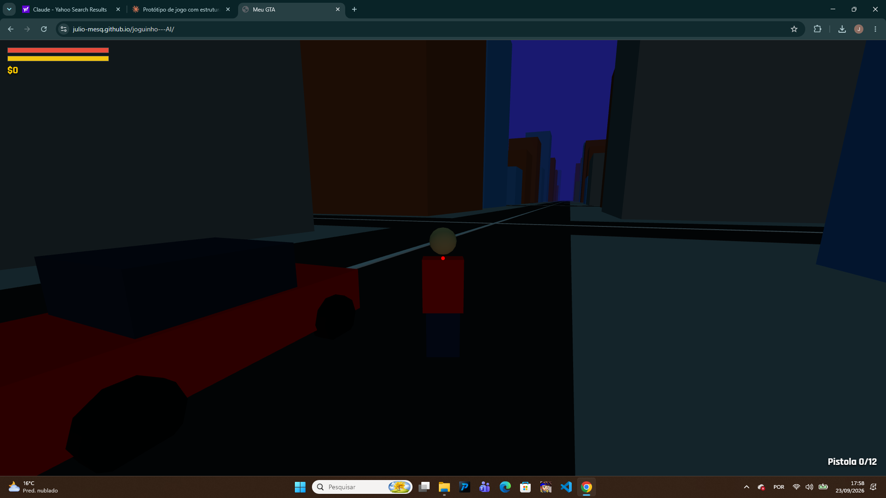

# Meu GTA (protótipo 3D no navegador)

## Jogar rápido
Extraia o zip e dê dois cliques em `iniciar.bat` (Windows) ou execute `./iniciar.sh` (Mac/Linux). Precisa de Python 3 e internet (Three.js vem de CDN).

## VS Code
1. Abra a pasta `meu-gta` no VS Code. 2. No terminal: `python -m http.server 8000`. 3. Acesse http://localhost:8000
(Módulos ES não funcionam por `file://`; use sempre um servidor.)

## GitHub Pages
Envie o **conteúdo** da pasta para um repositório; em Settings > Pages escolha branch `main`, pasta `/ (root)`; abra `https://SEU-USUARIO.github.io/NOME-DO-REPO/`.

## Controles
WASD mover · Mouse olhar · Shift correr · C agachar · Espaço pular (freio no carro) · F atirar · R recarregar · 1-6 armas · E entrar/sair do veículo · H buzina · G falar com NPC (1-3 escolhem) · V câmera (5 modos) · Tab inventário · M mapa · K chuva · P modo foto · B cor do carro · ESC pausa · HESOYAM = cheat

## Módulos (src/)
- `world.js`: cidade 2x2 km, prédios instanciados, praia, montanhas, dia/noite, colisão.
- `player.js`: humanoide, movimento, pulo, agachar, stamina.
- `vehicles.js`: carros (aceleração, freio, direção, dano).
- `npcs.js`: 30 NPCs (4 policiais) que andam, fogem e perseguem.
- `weapons.js`: tabela das 6 armas.
- `audio.js`: música, tiros, passos, motor, buzina, sirene e cliques (Web Audio, sem arquivos); volume no menu.
- `ui.js`: HUD, minimapa, mapa grande, inventário, notificações.
- `choices.js`: escolhas com karma salvo em localStorage (fallback em memória).
- `weather.js`: chuva e neblina. `effects.js`: explosões e fumaça. `missions.js`: missão principal + 3 finais.
- `pov.js`: câmeras e transições suaves.

## Ainda não incluído
Física com Cannon/Rapier, GSAP, Howler.js (usei Web Audio), modelos .glb com Draco, texturas .webp, semáforos, LOD/chunks, loja de carros, garagem, missões secundárias e split-screen.
